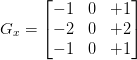

<h1> Sobel Kernel </h1>

- Normal computation of Gx and Gy and the orientation is inefficient. 
- The Sobel Kernel offers a more computationally efficient alternative.
- To calculate the gradient, we convolve the image neighborhood with the Sobel kernel

or the Scharr Kernel

For edge detection, the gradient representation is extremely sensitive to local noise. We need to add in a few more steps to create an actual robust edge detector using the gradient as a building block.

<h1> Edges </h1>

Edges are classified into 4 main classes in images -

- **Step Edge**
- **Ramp Edge**
- **Ridge Edge**
- **Roof Edge**

<h2> Canny Edge Detector </h2>

Since simple gradients are too noisy to cleanly detect edges, we use an ensemble of steps in Canny

- Convert image to grayscale and do a Gaussian Blur to iron out noise
- Calculate Gx and Gy and the gradient orientation using the Sobel operator
- To remove noise from gradient output, perform non-maxima suppression
- Filter out the resulting image using hysteresis thresholding
