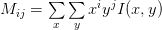
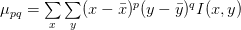

<h1> Features </h1>

<h2> Feature Vector</h2>

- Enable us to quantify an image as a list of numbers

<h2> Image Descriptor </h2>
<h2> Feature Descriptor </h2>

<h1> Exploring Image Descriptors </h1>

<h2> Color Channel Statistics </h2>

- **Relevant OpenCV Methods** : <a href="http://docs.opencv.org/2.4/modules/core/doc/operations_on_arrays.html#meanstddev">cv2.meanStdDev</a> (Note : Calculates mean, std deviation for all channels of image)
- **NumPy Tip** : Multi-dimensional matrices can be converted to single-dimensional ones by using <code> flatten </code>

<h2> Moments </h2>

- Image moments often quantify **shape**, **area** and **orientation** of objects in images
- Common moments : **mean**, **variance**, **std deviation**, **skew**, **kurtosis**
- Regular moments can be computed as 

- Invariance in moments (to enable practical use in feature vectors) is achieved by making measurements relative to a base value viz. for translation invariance, measurements are made by calculating the centroid first and then subtracting it from the x, y coordinates being used

- This is known as a **Relative Moment** - but they are not very robust practically

<h3> Hu Moments </h3>

- **Relevant OpenCV Methods** : cv2.HuMoments
- Image descriptor
- Generally computed on binary image (preferred) or contour
- 7 moments to characterize objects in image - built using relative moments

<h1> Exploring Feature Descriptors </h1>
